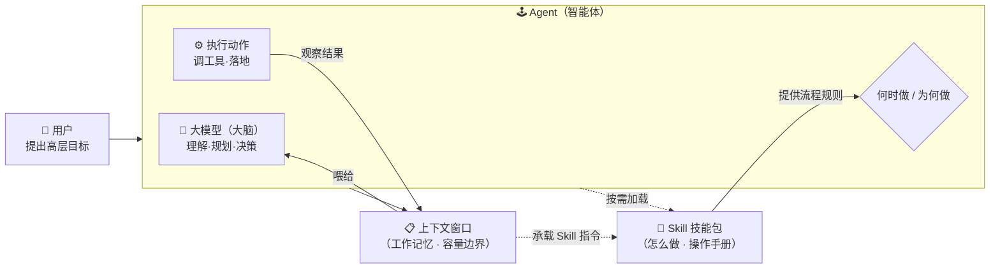
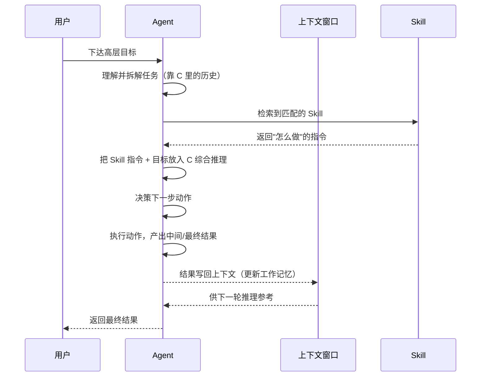

# Agent、上下文 与 Skill 的关系

> 说明：本文档用 Mermaid 流程图 + 文字，讲清三个高频 AI/Agent 概念之间的关系。
> 配套学习资料见 [`skll/`](./skll/) 目录下的三份 HTML（Agent / 大模型的上下文 / Skill）。

---

## 1. 一句话关系

**Agent 是"会办事的大脑 + 行动体"，上下文是它的"工作记忆容量"，Skill 是它的"专业操作手册"。**
Agent 靠上下文"看懂眼前的事"，靠 Skill"知道该怎么做"，二者共同支撑它把一个高层目标落地成具体行动。

| 概念 | 回答的问题 | 类比 |
|---|---|---|
| **Agent** | 谁来干？什么时候调谁？ | 项目经理 / 总指挥 |
| **上下文 (Context Window)** | 它能"记住/看到"多长？ | 工作台 / 黑板 / 工作记忆 |
| **Skill** | 具体怎么干？按什么流程？ | 职业资格证 / 专长包 / 操作手册 |

---

## 2. Mermaid 总体关系图

**读图要点**
- Agent 是外壳与主体，包着"大模型大脑 + 决策 + 行动"。
- **上下文**不断向大脑喂"现状与历史"；行动产生的新观察又写回上下文，形成闭环。
- **Skill** 由 Agent 按需加载，给"何时/为何做"提供"怎么做"的依据。
- 上下文与 Skill 之间有一条**虚线回路**：Skill 的指令正文最终也要读进上下文窗口才生效（这正是 Skill 采用"渐进披露、按需加载"的原因——为了少占上下文）。

---

## 3. 逐条关系拆解

### 3.1 Agent → 上下文（Agent 依赖上下文）

- Agent 的核心大脑是 LLM，而 LLM 一次只能"看"进**上下文窗口**那么大范围的内容。
- 多轮对话、长文档、工具返回结果，都要挤进这个窗口；**写满即遗忘最早内容**。
- 结论：上下文是 Agent 推理与记忆的**硬性容量边界**。Agent 设计时要想办法"用省窗口"（摘要、检索、只取关键片段），否则会"失忆"。

### 3.2 Agent → Skill（Agent 调用 Skill）

- Agent 接到高层目标后，需要知道"具体怎么做"，这就是 Skill 的职责：它把某个领域的**流程与规则**写进 `SKILL.md`。
- Agent 在运行时扫描各 Skill 的 `name + description`，命中就加载并遵循执行。
- 结论：Skill 是 Agent 的**能力单元 / 专业手册**；没有 Skill，Agent 只会泛泛而谈、不懂你的特定规范。

### 3.3 Skill 与上下文（Skill 也"住"在上下文里）

- Skill 本质上是一段"运行时读入模型上下文的指令文本"，**不是训练出的模型参数**。
- 因此，一个 Skill 被激活时，它的正文会占用上下文窗口的 token。
- 这解释了为什么 Skill 采用**渐进式披露（Progressive Disclosure）**：平时只暴露很小的元数据，需要时才展开正文——**目的就是尽量少占上下文、省 token、避免拖垮 Agent 的长任务**。

### 3.4 三者合起来（一次真实执行）

---

## 4. 容易混淆的点

| 说法 | 对 / 错 | 澄清 |
|---|---|---|
| "上下文 = 长期记忆" | ❌ 错 | 上下文是**短期工作台**，满了就忘；长期记忆靠外部存储/RAG。 |
| "Skill = 一个新的模型" | ❌ 错 | Skill 是**指令文本**，不训练参数，靠加载执行。 |
| "能调工具 = 是 Agent" | ❌ 错 | 关键看**是否由模型自主决定下一步**，而非能不能调工具。 |
| "Skill 越大越好、常驻" | ❌ 错 | 越大越占上下文；应渐进披露、按需加载，指令要精炼。 |
| "Skill 帮 Agent 记住东西" | ✅ 部分 | Skill 提供"怎么做"的规则；"记住现状"仍靠上下文/记忆系统。 |

---

## 5. 最小记忆口诀

> **Agent 决定「何时、为何」做；Skill 规定「怎么、按什么流程」做；上下文决定 Agent「一次能看/记住多少」，三者的边界相互耦合——Skill 要省上下文，Agent 要靠上下文推理，最终在 Agent 的决策闭环里合成一体。**

---

*由 concept-tutor Skill 生成 · 关系图梳理 · 生成于 2026-09-08*
